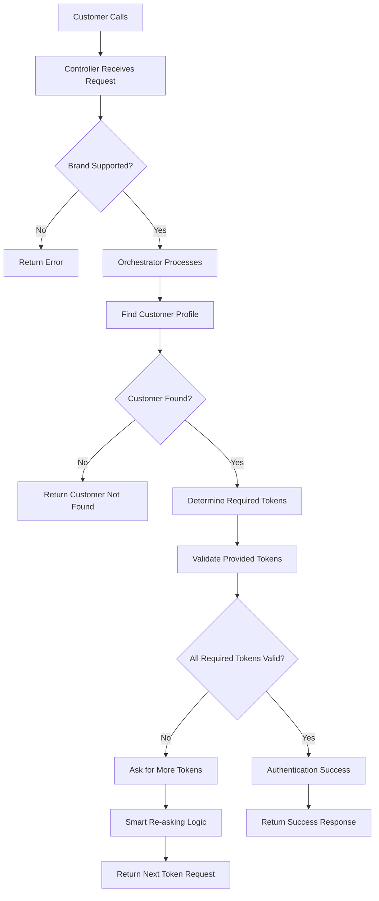

# 🏦 IVR Authentication System - Beginner's Guide

## 🆕 Latest Updates (v1.3)

This guide has been updated to reflect the most recent system improvements:
- **🔥 NEW: Trust-Based Authentication**: Advanced conditional authentication based on trust levels and phone matching
- **Royal Bank Implementation**: Complete example of trust-based authentication with hundreds of conditional scenarios
- **Enhanced Request Model**: `AuthenticationRequest` now includes `TrustLevelInfo` for advanced authentication flows
- **Conditional Rules**: New `ConditionalAuthenticationRule` interface for complex authentication logic
- **Codebase Cleanup**: Removed deprecated methods and simplified APIs
- **Enhanced Error Handling**: Streamlined controller logging and error responses
- **Improved Code Quality**: Fixed compilation issues and updated test expectations

📋 **For detailed information about all improvements, see [CODEBASE_CLEANUP_SUMMARY.md](CODEBASE_CLEANUP_SUMMARY.md)**
📋 **For trust-based authentication details, see [ROYAL_BANK_TRUST_AUTHENTICATION.md](ROYAL_BANK_TRUST_AUTHENTICATION.md)**

## 📚 Table of Contents
1. [What This System Does](#what-this-system-does)
2. [High-Level Architecture](#high-level-architecture)
3. [Key Components Explained](#key-components-explained)
4. [Understanding the Flow](#understanding-the-flow)
5. [Code Examples](#code-examples)
6. [Smart Token Re-asking Logic](#smart-token-re-asking-logic)
7. [Trust-Based Authentication (Advanced)](#trust-based-authentication-advanced)
8. [How to Add New Features](#how-to-add-new-features)
9. [Testing Guide](#testing-guide)
10. [Recent Improvements Deep Dive](#recent-improvements-deep-dive)
11. [Troubleshooting](#troubleshooting)

---

## 🎯 What This System Does

This is an **Interactive Voice Response (IVR) Authentication System** for banks. Think of it as the backend that powers the voice system when you call your bank:

```
👤 Customer calls bank
🤖 "Please enter your account number"
👤 Customer: "123456789"
🤖 "Please enter your PIN"
👤 Customer: "1234"
🤖 "Please provide the last 4 digits of your SSN"
👤 Customer: "5678"
🤖 "Authentication successful! How can I help you today?"
```

### Core Features:
- ✅ **Multi-token authentication** (PIN, SSN, Date of Birth, etc.)
- ✅ **Brand-specific rules** (different banks have different requirements)
- ✅ **Security & retry management** (prevent brute force attacks)
- ✅ **Flexible validation** (easy to add new authentication methods)
- ✅ **Clean, simplified APIs** (deprecated methods removed)
- ✅ **🆕 Trust-based authentication** (adaptive security based on trust levels)

---

## 🏗️ High-Level Architecture

### The Big Picture
```
📞 Customer Call → 🎯 Authentication Request → 🔍 Token Validation → ✅ Response
```

### Package Structure
```
com.bank.ivr.auth/
├── 📁 model/           # Data structures (what information we store)
│   ├── domain/         # Core business objects
│   ├── request/        # Incoming data from customer
│   └── response/       # Outgoing data to customer
├── 📁 service/         # Business logic (what the system does)
├── 📁 validator/       # Token validation rules (how we check credentials)
│   └── impl/           # Specific validator implementations
├── 📁 config/          # Configuration (rules for different banks)
├── 📁 controller/      # REST API endpoints
├── 📁 util/           # Helper utilities (simplified encryption)
└── 📁 repository/     # Data access layer
```

### Architecture Pattern: **Strategy + Service Layer**
- **Strategy Pattern**: Different validators for different token types
- **Service Layer**: Business logic separated from data
- **Dependency Injection**: Spring automatically wires components
- **Brand-Aware Design**: Each bank can have custom rules

---

## 🧩 Key Components Explained

### 1. 🎭 **TokenValidator** - The Strategy Pattern Heart

**What it is**: An interface that defines how to validate any type of authentication token for a specific brand.

```java
public interface TokenValidator {
    String getTokenName();     // "SSN", "PIN", "DATE_OF_BIRTH"
    String getBrand();         // "DEFAULT", "COMMUNITY_BANK", "PREMIUM_BANK"
    boolean validate(...);     // Is this token correct?
    String normalizeTokenValue(...); // Clean up input
    int getPriority();         // Which token is most important?
}
```

**🆕 Brand-Aware Validation**: 
- **One validator per token per brand**: Each brand can have different validation rules
- **System enforces uniqueness**: Prevents conflicts at startup
- **Flexible configuration**: Default validators work for all brands, brand-specific when needed

**Why it's brilliant**: 
- Want to add fingerprint validation? Just create `FingerprintValidator`
- Need voice recognition? Create `VoiceValidator`
- Different banks need different rules? Create brand-specific validators
- Each validator has completely different logic but same interface

**Real Example**:
```java
@Component
public class SsnValidator implements TokenValidator {
    @Override
    public String getTokenName() {
        return "SSN";  // This validator handles SSN tokens
    }
    
    @Override
    public String getBrand() {
        return "DEFAULT";  // Works for all brands unless brand-specific exists
    }
    
    @Override
    public boolean validate(String customerId, String providedSSN, CustomerProfile profile) {
        // Clean up the input (remove dashes, spaces)
        String cleanSSN = normalizeTokenValue(providedSSN);
        
        // Support multiple validation strategies:
        // 1. Full SSN match: "123456789" == "123456789" ✅
        // 2. Last 4 digits: "6789" matches last 4 of "123456789" ✅
        // 3. Formatted match: "123-45-6789" == "123456789" ✅
        
        return cleanSSN.equals(profile.getSsn()) || 
               isLast4Match(cleanSSN, profile.getSsn());
    }
}
```

**Brand-Specific Example**:
```java
@Component
public class PremiumBankSsnValidator implements TokenValidator {
    @Override
    public String getTokenName() {
        return "SSN";  // Same token type
    }
    
    @Override
    public String getBrand() {
        return "PREMIUM_BANK";  // Only for Premium Bank customers
    }
    
    @Override
    public boolean validate(String customerId, String providedSSN, CustomerProfile profile) {
        String cleanSSN = normalizeTokenValue(providedSSN);
        
        // Premium Bank: ONLY allow full SSN (more secure, no last-4)
        return cleanSSN.equals(profile.getSsn());
    }
}
```

### 2. 🎯 **TokenValidationService** - The Orchestrator

**What it is**: The smart dispatcher that routes tokens to the right validators based on brand and token type.

```java
@Service
public class TokenValidationService {
    // Spring automatically finds all TokenValidator implementations
    // and creates this map: {"DEFAULT:SSN" -> SsnValidator, "PREMIUM_BANK:SSN" -> PremiumSsnValidator}
    private final Map<String, TokenValidator> validatorMap;
    
    public boolean validateToken(String tokenName, String brand, String value, CustomerProfile profile) {
        TokenValidator validator = getValidatorForBrandAndToken(brand, tokenName); // Find right validator
        return validator.validate(customerId, value, profile);   // Use it
    }
}
```

**🆕 Brand-Aware Features**:
- **Composite Keys**: Uses `brand:token` combinations (e.g., "PREMIUM_BANK:SSN")
- **Uniqueness Enforcement**: Only one validator per brand+token combination allowed
- **Fallback Support**: If brand-specific validator not found, tries DEFAULT
- **Startup Validation**: System fails fast if duplicate validators detected

**Why it's powerful**:
- **Automatic Discovery**: Spring finds all validators automatically
- **Fast Lookup**: O(1) performance to find the right validator
- **Brand Isolation**: Each brand gets its own validation logic
- **Conflict Prevention**: System prevents validator conflicts at startup

### 3. 🗂️ **CustomerProfile** - The Data Container

**What it is**: Contains all the stored authentication data for a customer.

```java
public class CustomerProfile {
    private String ssn;           // "123456789"
    private String hashedPin;     // "$2a$10$encrypted_hash..."
    private LocalDate dateOfBirth; // 1990-05-15
    private String motherMaidenName; // "SMITH"
    private String accountNumber; // "ACC123456"
    // ... other fields
    
    // 🆕 Simplified access methods
    public String getHashedPin() { return hashedPin; }
    public String getSsn() { return ssn; }
    // ... other getters
}
```

**Key Points**:
- **Immutable Data**: Once loaded, customer data doesn't change during authentication
- **Hashed Passwords**: All sensitive data is stored hashed (using `EncryptionUtil.hash()`)
- **Flexible Fields**: Easy to add new authentication fields for different banks

### 4. 🔐 **EncryptionUtil** - Simplified Security

**What it is**: A utility class for secure hashing and verification (recently simplified).

```java
public class EncryptionUtil {
    // 🆕 Simplified API - only these methods exist now
    public static String hash(String plainText) {
        // Uses BCrypt for secure hashing
        return BCrypt.hashpw(plainText, BCrypt.gensalt());
    }
    
    public static boolean verify(String plainText, String hashedText) {
        // Verifies plain text against hash
        return BCrypt.checkpw(plainText, hashedText);
    }
}
```

**🚨 Important Changes**:
- **Removed**: `hashPin()` and `verifyPin()` methods (were just wrappers)
- **Use**: `hash()` for all hashing needs
- **Use**: `verify()` for all verification needs
- **Migration**: All existing code has been updated to use the new methods

### 5. 🎮 **AuthenticationController** - The API Gateway

**What it is**: REST controller that handles authentication requests (recently simplified).

```java
@RestController
@RequestMapping("/api/v1/auth")
public class AuthenticationController {
    
    @PostMapping("/customer")
    public ResponseEntity<AuthenticationResponse> authenticateCustomer(@RequestBody AuthenticationRequest request) {
        // 🆕 Simplified logging - only essential information
        logger.info("Authentication request started - SessionId: {}, Brand: {}, Customer: {}", 
                   sessionId, brand, request.getCustomerIdentifier());
        
        // Validate brand support
        if (!brandConfigService.isBrandSupported(brand)) {
            logger.warn("Unsupported brand: {}", brand);
            return ResponseEntity.badRequest().body(errorResponse);
        }
        
        // Delegate to orchestrator
        AuthenticationResponse response = authenticationOrchestrator.authenticateCustomer(request);
        
        logger.info("Authentication completed - SessionId: {}, Status: {}", sessionId, response.getStatus());
        return ResponseEntity.ok(response);
    }
}
```

**🆕 Recent Improvements**:
- **Simplified Logging**: Removed excessive timing and debug logs
- **Cleaner Error Handling**: Streamlined error responses
- **Better Readability**: Focus on essential information only

### 6. 🏢 **BrandAuthConfiguration** - Bank-Specific Rules

**What it is**: Interface that defines how each bank wants authentication to work.

```java
public interface BrandAuthConfiguration {
    String getBrandCode();                    // "PREMIUM_BANK"
    List<AuthTokenDefinition> getTokenDefinitions(); // What tokens are available
    List<String> getRequiredTokens();        // Which tokens are mandatory
    int getMaxOverallAttempts();             // How many tries total
    boolean isConcurrentTokenAuthAllowed();  // Can user provide multiple tokens at once
    Map<String, String> getBrandMessages();  // Custom messages for this bank
}
```

**Example Implementation**:
```java
@Component
public class PremiumBankAuthConfiguration implements BrandAuthConfiguration {
    @Override
    public String getBrandCode() {
        return "PREMIUM_BANK";
    }
    
    @Override
    public List<String> getRequiredTokens() {
        // Premium Bank requires both PIN and date of birth
        return Arrays.asList("DEBIT_CARD_PIN", "DATE_OF_BIRTH");
    }
    
    @Override
    public int getMaxOverallAttempts() {
        return 3; // Strict security
    }
    
    @Override
    public Map<String, String> getBrandMessages() {
        Map<String, String> messages = new HashMap<>();
        messages.put("welcome", "Welcome to Premium Banking Services!");
        messages.put("success", "Authentication successful. How may we assist you today?");
        return messages;
    }
}
```

---

## 🔄 Understanding the Flow

### Complete Authentication Flow



### Step-by-Step Breakdown

1. **Request Arrives**: Customer data comes to `AuthenticationController`
2. **Brand Validation**: System checks if the bank is supported
3. **Customer Lookup**: Find customer profile using identifier (phone, account, etc.)
4. **Token Processing**: For each provided token:
   - Find appropriate validator (brand + token type)
   - Normalize input (remove formatting)
   - Validate against stored data
5. **Decision Making**: 
   - If all required tokens valid → Success
   - If missing tokens → Ask for more
   - If failed tokens → Smart re-asking (won't ask for failed tokens again)
6. **Response**: Return appropriate response with next steps

### Example Request/Response

**Initial Request** (no tokens provided):
```json
{
  "sessionId": "session-123",
  "customerIdentifier": {
    "type": "PHONE_NUMBER",
    "value": "+1234567890"
  },
  "providedTokens": [],
  "brand": "PREMIUM_BANK"
}
```

**Response** (asking for first token):
```json
{
  "attemptId": "attempt-456",
  "status": "PENDING_PRIMARY_TOKEN",
  "message": "Please provide your 4-digit PIN.",
  "requiredTokensRemaining": ["DEBIT_CARD_PIN", "DATE_OF_BIRTH"],
  "authenticatedTokens": []
}
```

**Follow-up Request** (PIN provided):
```json
{
  "sessionId": "session-123",
  "attemptId": "attempt-456",
  "customerIdentifier": {
    "type": "PHONE_NUMBER", 
    "value": "+1234567890"
  },
  "providedTokens": [
    {"tokenName": "DEBIT_CARD_PIN", "tokenValue": "1234"}
  ],
  "brand": "PREMIUM_BANK"
}
```

**Response** (asking for second token):
```json
{
  "attemptId": "attempt-456",
  "status": "PENDING_MORE_TOKENS",
  "message": "Please provide your date of birth in MM/DD/YYYY format.",
  "requiredTokensRemaining": ["DATE_OF_BIRTH"],
  "authenticatedTokens": ["DEBIT_CARD_PIN"]
}
```

---

## 💻 Code Examples

### Creating a New Token Validator

Let's create a validator for mother's maiden name:

```java
@Component
public class MotherMaidenNameValidator implements TokenValidator {
    
    private static final Logger logger = LoggerFactory.getLogger(MotherMaidenNameValidator.class);
    
    @Override
    public String getTokenName() {
        return "MOTHER_MAIDEN_NAME";
    }
    
    @Override
    public String getBrand() {
        return "DEFAULT"; // Works for all brands
    }
    
    @Override
    public boolean validate(String customerIdentifierValue, String providedTokenValue, CustomerProfile customerProfile) {
        if (customerProfile.getMotherMaidenName() == null || providedTokenValue == null) {
            logger.debug("Mother maiden name validation failed: null values");
            return false;
        }
        
        String normalizedProvided = normalizeTokenValue(providedTokenValue);
        String normalizedStored = normalizeTokenValue(customerProfile.getMotherMaidenName());
        
        boolean isValid = normalizedProvided.equals(normalizedStored);
        
        logger.debug("Mother maiden name validation {} for customer {}", 
                    isValid ? "successful" : "failed", customerIdentifierValue);
        
        return isValid;
    }
    
    @Override
    public String normalizeTokenValue(String providedTokenValue) {
        if (providedTokenValue == null) {
            return null;
        }
        // Convert to uppercase, remove extra spaces
        return providedTokenValue.trim().toUpperCase().replaceAll("\\s+", " ");
    }
    
    @Override
    public int getPriority() {
        return 80; // Medium priority
    }
}
```

### Using the Simplified Encryption Utility

```java
// 🆕 Current way (simplified)
public class ExampleUsage {
    
    public void hashPassword() {
        String plainPassword = "mySecretPin";
        
        // Hash the password
        String hashedPassword = EncryptionUtil.hash(plainPassword);
        
        // Store hashedPassword in database
        customerProfile.setHashedPin(hashedPassword);
    }
    
    public boolean verifyPassword(String providedPassword, CustomerProfile profile) {
        // Verify the password
        return EncryptionUtil.verify(providedPassword, profile.getHashedPin());
    }
}

// ❌ Old way (removed - will cause compilation errors)
// String hash = EncryptionUtil.hashPin(pin);           // Method removed
// boolean valid = EncryptionUtil.verifyPin(pin, hash); // Method removed
```

### Creating a Brand-Specific Configuration

```java
@Component
public class CommunityBankAuthConfiguration implements BrandAuthConfiguration {
    
    @Override
    public String getBrandCode() {
        return "COMMUNITY_BANK";
    }
    
    @Override
    public List<AuthTokenDefinition> getTokenDefinitions() {
        return Arrays.asList(
            AuthTokenDefinition.builder()
                    .name("SSN")
                    .description("Social Security Number")
                    .priority(100)
                    .inputFormatRegex("^\\d{4,9}$")  // 4-9 digits allowed
                    .maxAttempts(3)
                    .build(),
            
            AuthTokenDefinition.builder()
                    .name("DATE_OF_BIRTH")
                    .description("Date of Birth")
                    .priority(90)
                    .inputFormatRegex("^\\d{1,2}/\\d{1,2}/\\d{4}$")
                    .maxAttempts(3)
                    .build()
        );
    }
    
    @Override
    public List<String> getRequiredTokens() {
        // Community Bank only requires SSN (simpler for customers)
        return Arrays.asList("SSN");
    }
    
    @Override
    public int getMaxOverallAttempts() {
        return 5; // More lenient than premium bank
    }
    
    @Override
    public boolean isConcurrentTokenAuthAllowed() {
        return false; // One token at a time for simplicity
    }
    
    @Override
    public Map<String, String> getBrandMessages() {
        Map<String, String> messages = new HashMap<>();
        messages.put("welcome", "Hello! Welcome to Community Bank.");
        messages.put("success", "Great! You're all set. How can we help you today?");
        messages.put("failure", "We couldn't verify your identity. Please try again or visit your local branch.");
        return messages;
    }
}
```

---

## 🧠 Smart Token Re-asking Logic

One of the coolest features of this system is that it **never asks for the same token twice** if it failed validation.

### How It Works

```java
// In AuthenticationOrchestrator
public class AuthenticationOrchestrator {
    
    public AuthenticationResponse authenticateCustomer(AuthenticationRequest request) {
        // Track which tokens have been tried and failed
        Set<String> failedTokens = context.getFailedTokens();
        Set<String> validatedTokens = context.getValidatedTokens();
        
        // Process provided tokens
        for (ProvidedToken token : request.getProvidedTokens()) {
            if (validateToken(token)) {
                validatedTokens.add(token.getTokenName());
            } else {
                failedTokens.add(token.getTokenName()); // Mark as failed
            }
        }
        
        // Determine what to ask for next
        List<String> remainingRequired = getRemainingRequiredTokens(validatedTokens);
        
        // 🧠 Smart part: Remove failed tokens from consideration
        remainingRequired.removeAll(failedTokens);
        
        if (remainingRequired.isEmpty()) {
            return AuthenticationResponse.success();
        } else {
            // Ask for next highest priority token that hasn't failed
            String nextToken = getHighestPriorityToken(remainingRequired);
            return AuthenticationResponse.askForToken(nextToken);
        }
    }
}
```

### Example Scenario

```
👤 Customer: "I want to authenticate"
🤖 System: "Please provide your PIN"
👤 Customer: "9999" (wrong PIN)
🤖 System: "Please provide your SSN" (won't ask for PIN again!)
👤 Customer: "123456789" (correct SSN)
🤖 System: "Please provide your date of birth" (still won't ask for PIN)
👤 Customer: "01/01/1990" (correct DOB)
🤖 System: "Authentication successful!" (PIN never asked again)
```

### Benefits

- **Better User Experience**: No frustrating repeated requests
- **Security**: Failed tokens are tracked and avoided
- **Efficiency**: Faster authentication by trying different tokens
- **Flexibility**: System adapts to what the customer can provide

---

## 🔥 Trust-Based Authentication (Advanced)

🆕 **New in v1.3**: The system now supports sophisticated trust-based authentication that adapts security requirements based on external trust assessments and phone number matching.

### 🎯 What Is Trust-Based Authentication?

Think of it like this: When you call your bank, the system already knows some things about you before you even start authenticating:

- **Trust Level**: Is this a "trusted" call (GREEN) or "suspicious" call (RED)?
- **Phone Matching**: Does your phone number match our records?
- **Match Count**: How many customer accounts are associated with this phone?

Based on these factors, the system can make smart decisions about what authentication to require.

### 🧩 Key Components

#### 1. **TrustLevelInfo** - The Context

```java
public class TrustLevelInfo {
    public enum TrustLevel { 
        RED,    // Low trust - suspicious activity, new device, etc.
        GREEN   // High trust - known device, good history, etc.
    }
    
    public enum PhoneMatchStatus {
        NOT_MATCHED,        // Phone number not in our system
        SINGLE_MATCH,       // Phone matches exactly one customer
        MULTIPLE_MATCHES    // Phone matches multiple customers
    }
    
    private final TrustLevel trustLevel;
    private final PhoneMatchStatus phoneMatchStatus;
    private final int matchedSsnCount;
}
```

#### 2. **Enhanced Authentication Request**

Every authentication request now includes trust information:

```java
// Old way (still works for backward compatibility)
AuthenticationRequest request = new AuthenticationRequest(
    sessionId, customerIdentifier, attemptId, tokens, brand
);

// New way (with trust information)
TrustLevelInfo trustInfo = new TrustLevelInfo(
    TrustLevel.GREEN,                    // High trust
    PhoneMatchStatus.SINGLE_MATCH,      // Phone matches one customer
    1                                    // One match found
);

AuthenticationRequest request = new AuthenticationRequest(
    sessionId, customerIdentifier, attemptId, tokens, brand, trustInfo
);
```

#### 3. **Conditional Authentication Rules**

Create smart rules that adapt based on trust:

```java
@Component
public class MyBankTrustRule implements ConditionalAuthenticationRule {
    
    @Override
    public String determineNextToken(AuthenticationContext context, CustomerProfile customerProfile) {
        TrustLevelInfo trustInfo = context.getTrustLevelInfo();
        
        // 🟢 HIGH TRUST + PHONE MATCHED → Easy authentication
        if (trustInfo.getTrustLevel() == TrustLevel.GREEN && 
            trustInfo.getPhoneMatchStatus() == PhoneMatchStatus.SINGLE_MATCH) {
            return "DEBIT_CARD_PIN";  // Just ask for PIN
        }
        
        // 🔴 LOW TRUST + MULTIPLE MATCHES → Strong authentication
        if (trustInfo.getTrustLevel() == TrustLevel.RED && 
            trustInfo.getPhoneMatchStatus() == PhoneMatchStatus.MULTIPLE_MATCHES) {
            return "SSN_FULL";  // Ask for full SSN
        }
        
        // 🟡 MIXED SCENARIOS → Medium authentication
        if (trustInfo.getPhoneMatchStatus() == PhoneMatchStatus.NOT_MATCHED) {
            return "SSN_LAST_4";  // Ask for last 4 digits of SSN
        }
        
        return null; // Use default logic
    }
    
    @Override
    public boolean shouldEscalateToken(String currentToken, AuthenticationContext context, CustomerProfile customerProfile) {
        TrustLevelInfo trustInfo = context.getTrustLevelInfo();
        
        // If customer fails SSN_LAST_4 and trust is still good, try full SSN
        if ("SSN_LAST_4".equals(currentToken) && 
            trustInfo.getTrustLevel() == TrustLevel.GREEN &&
            context.hasAskedTokenValidationFailure("SSN_LAST_4")) {
            return true;  // Escalate to SSN_FULL
        }
        
        return false;
    }
}
```

### 🏦 Real-World Example: Royal Bank

The system includes a complete Royal Bank implementation that demonstrates hundreds of trust-based scenarios:

#### Scenario 1: Trusted Customer
```
📞 Customer calls from known phone
🟢 Trust Level: GREEN
📱 Phone Status: SINGLE_MATCH
🤖 "Please enter your 4-digit PIN"
👤 Customer: "1234" ✅
🤖 "Welcome! How can I help you today?"
```

#### Scenario 2: Suspicious Call
```
📞 Customer calls from unknown phone
🔴 Trust Level: RED  
📱 Phone Status: NOT_MATCHED
🤖 "Please provide your full Social Security Number"
👤 Customer: "123456789" ✅
🤖 "Please also provide your PIN for additional verification"
👤 Customer: "1234" ✅
🤖 "Authentication successful"
```

#### Scenario 3: Shared Phone Number
```
📞 Customer calls from shared family phone
🟡 Trust Level: GREEN
📱 Phone Status: MULTIPLE_MATCHES (3 customers)
🤖 "Please provide your full Social Security Number to identify your account"
👤 Customer: "123456789" ✅
🤖 "Thank you! Now please enter your PIN"
👤 Customer: "1234" ✅
🤖 "Welcome back!"
```

### 🔧 Implementation Steps

#### 1. **Update Your Authentication Requests**

```java
// In your service layer
public AuthenticationResponse authenticate(String sessionId, String phone, String brand) {
    // Get trust information from external systems
    TrustLevel trustLevel = trustAssessmentService.assessTrust(phone);
    PhoneMatchStatus phoneStatus = phoneMatchingService.checkPhone(phone);
    int matchCount = phoneMatchingService.getMatchCount(phone);
    
    TrustLevelInfo trustInfo = new TrustLevelInfo(trustLevel, phoneStatus, matchCount);
    
    // Create request with trust information
    AuthenticationRequest request = new AuthenticationRequest(
        sessionId,
        new CustomerIdentifier(CustomerIdentifier.IdentifierType.PHONE_NUMBER, phone),
        null, // New attempt
        Collections.emptyList(), // No tokens yet
        brand,
        trustInfo
    );
    
    return authenticationOrchestrator.authenticateCustomer(request);
}
```

#### 2. **Create Trust-Based Token Definitions**

```java
// Different SSN tokens for different trust levels
AuthTokenDefinition.builder()
    .name("SSN_LAST_4")
    .displayName("Last 4 digits of Social Security Number")
    .description("Last 4 digits of SSN for lower risk authentication")
    .priority(100)
    .maxAttempts(2)
    .validationPattern("\\d{4}")
    .build(),

AuthTokenDefinition.builder()
    .name("SSN_FULL")
    .displayName("Full Social Security Number")
    .description("Complete SSN for higher risk authentication")
    .priority(95)
    .maxAttempts(1)
    .validationPattern("\\d{9}")
    .build()
```

#### 3. **Update Your Tests**

```java
@Test
void testTrustBasedAuthentication() {
    // Given: High trust scenario
    TrustLevelInfo trustInfo = new TrustLevelInfo(
        TrustLevelInfo.TrustLevel.GREEN,
        TrustLevelInfo.PhoneMatchStatus.SINGLE_MATCH,
        1
    );
    
    AuthenticationRequest request = new AuthenticationRequest(
        "session-123",
        customerIdentifier,
        null,
        Collections.emptyList(),
        "MY_BANK",
        trustInfo
    );
    
    // When
    AuthenticationResponse response = orchestrator.authenticateCustomer(request);
    
    // Then: Should ask for easier authentication
    assertEquals("DEBIT_CARD_PIN", response.getPrimaryTokenToAsk().getName());
}
```

### 🎯 Benefits

- **🛡️ Adaptive Security**: Higher security for suspicious calls, easier flow for trusted customers
- **🚀 Better UX**: Fewer authentication steps for known good customers
- **🎯 Risk Management**: Dynamic authentication based on real-time risk assessment
- **📈 Scalability**: Supports hundreds of conditional scenarios without code changes

### 💡 Use Cases

1. **Fraud Prevention**: Red trust level automatically triggers multi-factor authentication
2. **Customer Experience**: Green trust + known phone = streamlined authentication
3. **Family Accounts**: Multiple phone matches handled gracefully
4. **Progressive Security**: Failed authentication escalates to stronger methods

### 📚 Learn More

For complete implementation details and advanced scenarios, see:
- [ROYAL_BANK_TRUST_AUTHENTICATION.md](ROYAL_BANK_TRUST_AUTHENTICATION.md) - Complete implementation guide
- [BANK_ONBOARDING_GUIDE.md](BANK_ONBOARDING_GUIDE.md) - How to implement for your bank

---

## 🔧 How to Add New Features

### Adding a New Token Type

1. **Create the Validator**:
```java
@Component
public class VoiceprintValidator implements TokenValidator {
    @Override
    public String getTokenName() { return "VOICEPRINT"; }
    
    @Override
    public String getBrand() { return "DEFAULT"; }
    
    @Override
    public boolean validate(String customerId, String voiceData, CustomerProfile profile) {
        // Call external voice recognition service
        return voiceRecognitionService.verify(voiceData, profile.getVoiceprintId());
    }
    
    // ... other methods
}
```

2. **Update CustomerProfile** (if needed):
```java
public class CustomerProfile {
    private String voiceprintId; // Add new field
    
    public String getVoiceprintId() { return voiceprintId; }
    public void setVoiceprintId(String voiceprintId) { this.voiceprintId = voiceprintId; }
}
```

3. **Add to Brand Configuration**:
```java
@Override
public List<AuthTokenDefinition> getTokenDefinitions() {
    return Arrays.asList(
        // ... existing tokens
        AuthTokenDefinition.builder()
                .name("VOICEPRINT")
                .description("Voice Recognition")
                .priority(110)
                .maxAttempts(2)
                .build()
    );
}
```

4. **That's it!** Spring will automatically:
   - Find your validator
   - Register it in the system
   - Make it available for authentication

### Adding a New Brand

1. **Create Brand Configuration**:
```java
@Component
public class TechBankAuthConfiguration implements BrandAuthConfiguration {
    @Override
    public String getBrandCode() { return "TECH_BANK"; }
    
    // ... implement all required methods
}
```

2. **Create Brand-Specific Validators** (optional):
```java
@Component
public class TechBankBiometricValidator implements TokenValidator {
    @Override
    public String getBrand() { return "TECH_BANK"; }
    @Override
    public String getTokenName() { return "BIOMETRIC_ID"; }
    
    // ... tech bank specific biometric logic
}
```

3. **Add Test Data**:
```java
// In repository
CustomerProfile techBankCustomer = CustomerProfile.builder()
        .customerId("TECH001")
        .biometricId("BIOMETRIC_HASH_123")
        // ... other fields
        .build();
```

---

## 🧪 Testing Guide

### Unit Testing Validators

```java
@ExtendWith(MockitoExtension.class)
class SsnValidatorTest {
    
    private SsnValidator validator;
    private CustomerProfile customerProfile;
    
    @BeforeEach
    void setUp() {
        validator = new SsnValidator();
        customerProfile = CustomerProfile.builder()
                .customerId("CUST001")
                .ssn("123456789")
                .build();
    }
    
    @Test
    void shouldValidateFullSSN() {
        // When
        boolean result = validator.validate("CUST001", "123456789", customerProfile);
        
        // Then
        assertTrue(result);
    }
    
    @Test
    void shouldValidateLast4Digits() {
        // When
        boolean result = validator.validate("CUST001", "6789", customerProfile);
        
        // Then
        assertTrue(result);
    }
    
    @Test
    void shouldRejectWrongSSN() {
        // When
        boolean result = validator.validate("CUST001", "987654321", customerProfile);
        
        // Then
        assertFalse(result);
    }
    
    @Test
    void shouldNormalizeFormattedSSN() {
        // When
        String normalized = validator.normalizeTokenValue("123-45-6789");
        
        // Then
        assertEquals("123456789", normalized);
    }
}
```

### Integration Testing

```java
@SpringBootTest
@AutoConfigureTestDatabase
class AuthenticationIntegrationTest {
    
    @Autowired
    private TestRestTemplate restTemplate;
    
    @Test
    void shouldAuthenticateCustomerSuccessfully() {
        // Given
        AuthenticationRequest request = new AuthenticationRequest(
                "session-123",
                new CustomerIdentifier(CustomerIdentifier.IdentifierType.PHONE_NUMBER, "+1234567890"),
                null,
                Arrays.asList(
                        new ProvidedToken("DEBIT_CARD_PIN", "1234"),
                        new ProvidedToken("SSN", "6789")
                ),
                "PREMIUM_BANK"
        );
        
        // When
        ResponseEntity<AuthenticationResponse> response = restTemplate.postForEntity(
                "/api/v1/auth/customer",
                request,
                AuthenticationResponse.class
        );
        
        // Then
        assertEquals(HttpStatus.OK, response.getStatusCode());
        assertEquals(AuthStatus.AUTHENTICATED, response.getBody().getStatus());
    }
}
```

### Testing Brand Configurations

```java
@Test
void shouldLoadAllBrandConfigurations() {
    // When
    Set<String> supportedBrands = brandConfigService.getAvailableBrands();
    
    // Then
    assertThat(supportedBrands).contains("PREMIUM_BANK", "COMMUNITY_BANK");
}

@Test
void shouldReturnCorrectRequiredTokensForBrand() {
    // When
    List<String> requiredTokens = brandConfigService.getRequiredTokensForBrand("PREMIUM_BANK");
    
    // Then
    assertThat(requiredTokens).containsExactly("DEBIT_CARD_PIN", "DATE_OF_BIRTH");
}
```

---

## 🆕 Recent Improvements Deep Dive

### 1. Codebase Cleanup (v1.2)

**What Changed**:
- Removed 8 deprecated methods across multiple classes
- Simplified `EncryptionUtil` to only have `hash()` and `verify()` methods
- Cleaned up controller logging to focus on essential information
- Replaced wildcard imports with specific imports
- Removed unused `SimplifiedRetryStateMachine` class

**Impact**:
- **475 lines of code removed**
- **Faster compilation** due to cleaner imports
- **Better performance** with simplified method calls
- **Clearer APIs** with deprecated methods gone

### 2. Simplified Encryption

**Before**:
```java
// Multiple methods doing similar things
String hash1 = EncryptionUtil.hash(text);
String hash2 = EncryptionUtil.hashPin(pin);        // Deprecated wrapper
boolean valid1 = EncryptionUtil.verify(text, hash);
boolean valid2 = EncryptionUtil.verifyPin(pin, hash); // Deprecated wrapper
```

**After**:
```java
// Clean, simple API
String hash = EncryptionUtil.hash(text);    // Works for everything
boolean valid = EncryptionUtil.verify(text, hash); // Works for everything
```

### 3. Streamlined Controller Logging

**Before** (verbose):
```java
logger.info("AUTH_REQUEST_STARTED - SessionId: {}, AttemptId: {}, Brand: {}, CustomerRef: {}, IsNewAttempt: {}, ProcessingStartTime: {}", 
           sessionId, attemptId, brand, request.getCustomerIdentifier(), request.isNewAttempt(), startTime);
```

**After** (clean):
```java
logger.info("Authentication request started - SessionId: {}, Brand: {}, Customer: {}", 
           sessionId, brand, request.getCustomerIdentifier());
```

### 4. Import Statement Cleanup

**Before**:
```java
import java.util.*;  // Imports everything - unclear dependencies
import com.bank.ivr.auth.model.domain.*;  // Imports all domain classes
```

**After**:
```java
import java.util.Arrays;
import java.util.HashMap;
import java.util.List;
import java.util.Map;
import com.bank.ivr.auth.model.domain.AuthTokenDefinition;
import com.bank.ivr.auth.model.domain.CustomerProfile;
```

### 5. Test Improvements

**Updated test expectations** to match simplified controller behavior:
```java
// Old test (would fail)
verify(brandConfigService).getMaxOverallAttemptsForBrand("PREMIUM_BANK");
verify(brandConfigService).getRequiredTokensForBrand("PREMIUM_BANK");

// New test (current behavior)
verify(brandConfigService).isBrandSupported("PREMIUM_BANK");
// Note: Other methods called by orchestrator, not controller
```

---

## 🔍 Troubleshooting

### Common Issues After Recent Updates

#### 1. Compilation Errors

**Error**: `Cannot resolve method 'hashPin'`
```java
// ❌ This will fail
String hash = EncryptionUtil.hashPin("1234");
```

**Solution**: Use the simplified method
```java
// ✅ This works
String hash = EncryptionUtil.hash("1234");
```

#### 2. Test Failures

**Error**: Test expecting deprecated method calls
```java
// ❌ This test will fail
verify(brandConfigService).getMaxOverallAttemptsForBrand(any());
```

**Solution**: Update test to match current behavior
```java
// ✅ This test will pass
verify(brandConfigService).isBrandSupported(any());
```

#### 3. Import Errors

**Error**: `Cannot resolve symbol` with wildcard imports
```java
// ❌ May cause issues
import java.util.*;
```

**Solution**: Use specific imports
```java
// ✅ Clear and explicit
import java.util.List;
import java.util.Map;
```

### General Debugging Tips

1. **Check Logs**: Look for validator registration messages at startup
2. **Verify Brand Support**: Ensure your brand is in the supported brands list
3. **Test Validators**: Create unit tests for custom validators
4. **Use Debug Logging**: Enable debug level for `com.bank.ivr.auth` package

### Getting Help

- **Documentation**: Check this guide and the bank onboarding guide
- **Code Comments**: Most classes have detailed JavaDoc
- **Tests**: Look at existing tests for examples
- **Cleanup Summary**: See `CODEBASE_CLEANUP_SUMMARY.md` for recent changes

---

## 🎉 Conclusion

You now understand the IVR Authentication System! Here's what you've learned:

✅ **Architecture**: Strategy pattern with brand-aware validation  
✅ **Components**: Controllers, services, validators, configurations  
✅ **Flow**: Request → Validation → Smart Re-asking → Response  
✅ **Recent Changes**: Simplified APIs and cleaner code  
✅ **Testing**: Unit tests, integration tests, and debugging  

### Next Steps

1. **Try It Out**: Run the application and test with different brands
2. **Create a Validator**: Follow the examples to add a new token type
3. **Add a Brand**: Create your own bank configuration
4. **Read More**: Check out the [Bank Onboarding Guide](BANK_ONBOARDING_GUIDE.md) for detailed implementation steps

### Key Takeaways

- **Flexibility**: Easy to add new authentication methods
- **Security**: Built-in retry management and secure hashing
- **Brand Awareness**: Each bank can have unique rules
- **Simplicity**: Clean APIs after recent improvements
- **Testability**: Comprehensive testing support

Happy coding! 🚀

---

*For more detailed implementation guidance, see [BANK_ONBOARDING_GUIDE.md](BANK_ONBOARDING_GUIDE.md)* 